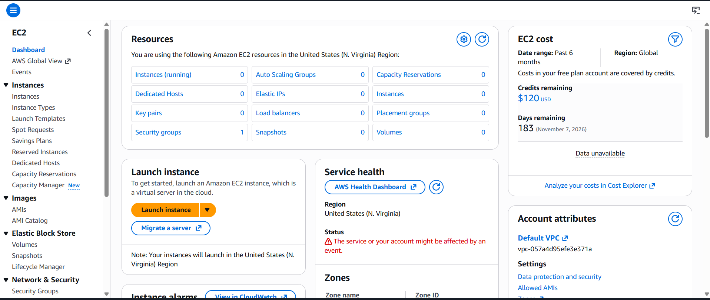

# 🎯 Day 0 — Welcome to the 10-Day AWS Challenge!

> **CloudDevOpsHub | AWS Cloud Cohort | Hosted by CloudDevOpsHub Community & Vikas Ratnawat**

---


## 🚀 How to Use This Repo

### 🍴 Step 1 — Fork This Repo
```
1. Click "Fork" at the top-right of this GitHub repo
2. It will be copied to your own GitHub account
3. Clone it locally:
   git clone https://github.com/YOUR_USERNAME/aws-10day-challenge
4. Do the practicals → Update your README with your own screenshots & notes
5. Push your changes:
   git add . && git commit -m "Day X complete ✅" && git push
```
> 💡 Your forked repo becomes your **public portfolio** — share it on LinkedIn!

---

### 🔐 Step 2 — Login & Watch Recorded Sessions
**Portal Login:**
👉 [https://devopswithvikas.com/eud/login/email](https://devopswithvikas.com/eud/login/email)

**Bookmark Your Recordings Page:**
👉 [https://devopswithvikas.com/eud/bookings](https://devopswithvikas.com/eud/bookings)

```
→ Login with your registered email
→ Go to "My Bookings" → Open AWS Cohort
→ Watch the Day-wise Recorded Video Session for today
→ Pause. Practice. Repeat.
```
> 📌 Recordings are valid for **8 weeks** — watch at your own pace!
>


---

### 👥 Step 3 — Invite Your Friends
Know someone who should learn AWS? 🔥

**Share this enrollment link with them:**
👉 [https://devopswithvikas.com/offer/top-10-aws-services-cohort-2026](https://devopswithvikas.com/offer/top-10-aws-services-cohort-2026)

```
✅ Top 10 AWS Services covered
✅ Hands-on practicals every day
✅ WhatsApp group support
✅ Resume-worthy projects
✅ Certificate on completion
✅ Mentored by Vikas Ratnawat from CloudDevOpsHub (PWC | Ex Microsoft MVP)
```

---

## 👋 Hello Future Cloud Engineers..! I'm Vikas!

Before we start this journey together, I just want to say —  
**I'm really excited to connect with you all!** 🙌

I ❤️ mentoring, sharing real-world Cloud & DevOps experience,  
and helping you grow faster in your career.

Let's connect personally — feel free to **Connect & Follow:**

| Platform | Link |
|----------|------|
| 🔗 Personal LinkedIn | [Vikas Ratnawat](https://www.linkedin.com/in/vikasratnawat/) |
| 🌐 Community LinkedIn | [CloudDevOpsHub](https://www.linkedin.com/in/clouddevopshub/) |
| 📸 Instagram | [@clouddevopshub](https://www.instagram.com/clouddevopshub/) |
| 🌍 Website | [devopswithvikas.com](https://devopswithvikas.com) |

> ✅ **Confirm with 👍 that you're connected — let's grow together! 🔥**

---

## 📋 Day 0 — Your Onboarding Checklist

Complete these steps **BEFORE Day 1** begins:

### 🎯 Step 1 — Watch Cohort Overview Video
👉 [https://www.youtube.com/watch?v=qBsjQ4lI7Zc](https://www.youtube.com/watch?v=qBsjQ4lI7Zc)

### 🔹 Step 2 — Watch Welcome Message
👉 [https://youtu.be/qZPWM3v6IdI](https://youtu.be/qZPWM3v6IdI)

### 📍 Step 3 — Login to Your Portal
👉 [https://devopswithvikas.com/eud/login/email](https://devopswithvikas.com/eud/login/email)

### 📌 Step 4 — Bookmark Your Recordings Page
👉 [https://devopswithvikas.com/eud/bookings](https://devopswithvikas.com/eud/bookings)  
*(All your session recordings will be available here)*

### 📊 Step 5 — Open Roadmap Tracking Sheet
👉 [Roadmap Tracking Sheet](https://docs.google.com/spreadsheets/d/1O-zAbF0vhV9ZPNo9Az3tpI4V-Caq0myNuvTqlS9S6K8/edit?gid=0#gid=0)

---

## ✅ Day 0 Confirmation Checklist

```
✅ Watched Cohort Overview Video
✅ Watched Welcome Message
✅ Logged into the portal
✅ Bookmarked the recordings page
✅ Opened roadmap tracking sheet
✅ Connected with Vikas on LinkedIn
✅ Followed CloudDevOpsHub Community
✅ Posted Day 0 on LinkedIn (template below 👇)
```

---

## 🛠️ Day 0 Task — Create Your AWS Account

```
Step 1: Go to → https://aws.amazon.com/free
Step 2: Sign up with a dedicated email
Step 3: Add credit/debit card (₹2 verification only — NOT charged)
Step 4: Choose "Basic Support — Free"
Step 5: Login to AWS Console → https://console.aws.amazon.com
Step 6: Take a screenshot of your AWS Console Dashboard

Step 7: Post on LinkedIn — Challenge Accepted! 🔥
```

> 💡 **Pro Tip:** Use a dedicated Gmail for AWS — keeps billing alerts clean and separate from personal mail!

---

## 👨‍💻 About Your Mentor — Vikas Ratnawat

```
🏢 Experience: 15+ Year's & Founder of CloudDevOpsHub Community | PWC 
🏆 Microsoft MVP
👥 Community: 58,000+ Members — CloudDevOpsHub
🎓 Students Trained: 10,000+
📦 Cohorts Completed: 43+
📍 Location: Indore & Bangalore, India
```

> *"Problem hai toh structure aur guidance ki kami hoti hai — knowledge ki nahi.  
> Is cohort mein mein tumhe woh structure dunga jo tumhe job-ready banayega."*  
> — Vikas Ratnawat

---

## 📅 Your 10-Day Roadmap Preview

| Day | Topic | Key Project |
|-----|-------|-------------|
| [Day 1](../Day-01/README.md) | AWS Intro + EC2 | First VM on Cloud |
| [Day 2](../Day-02/README.md) | EC2 Deep Dive | Live Website on AWS |
| [Day 3](../Day-03/README.md) | IAM Security | User Management + ELB |
| [Day 4](../Day-04/README.md) | AWS S3 | Resume Portfolio Live! |
| [Day 5](../Day-05/README.md) | S3 + RDS Intro | Storage Lifecycle Rules |
| [Day 6](../Day-06/README.md) | RDS Deep Dive | Real Database on AWS |
| [Day 7](../Day-07/README.md) | RDS Practical | Aurora + MySQL + PostgreSQL |
| [Day 8](../Day-08/README.md) | VPC Networking | 3-Tier Architecture |
| [Day 9](../Day-09/README.md) | Advanced Networking | VPC Peering + Private EC2 |
| [Day 10](../Day-10/README.md) | CloudWatch + 🏆 | Monitoring + CERTIFICATE |

---

## 🔥 The CloudDevOpsHub Promise

```
✅ Daily recordings on your portal
✅ WhatsApp group updates Daily for the next 10 days
✅ Step-by-step practicals
✅ Interview-focused content
✅ Real-world industry scenarios
✅ Resume-worthy projects
✅ 10-Day Completion Certificate
✅ Full refund if not satisfied
```
> [🏠 Back to Main](../README.md) | [Day 1 →](../Day-01/README.md)

---

*"Sirf recordings collect mat karo dost — actually seekho, practice karo, aur job-ready bano."*  
*— Vikas Ratnawat | CloudDevOpsHub*

> [🏠 Back to Main](../README.md) | [Day 1 →](../Day-01/README.md)

---

## 📣 LinkedIn Post — Copy & Customize

```
🚀 Challenge Accepted! I just joined the 10-Day AWS Cloud Challenge! 🔥

AWS Account ✅ Created.
10-Day Journey ✅ Begins NOW.
High-Package Cloud Career 🎯 — That's the goal!

Here's what I'm about to build in the next 10 days:
☁️ EC2 Virtual Machines
🔐 IAM Security
🪣 S3 Storage & Portfolio
🗄️ RDS Databases
🏗️ VPC Networking
👀 CloudWatch Monitoring
...and real projects for my resume!

This challenge is part of the AWS Cloud Cohort-6 by 
@Vikas Ratnawat | @CloudDevOpsHub Community
— India's Largest Cloud & DevOps Community (58,000+ FB Group + 52,000 WhatsApp Member's + 26,000 Insta + 13,000 YouTube )

If you're also on this journey — Drop a 🙋 in the comments!
Let's hold each other accountable 💪

Day 0 complete. Day 1 starts tomorrow. Let's GO! 🚀

#AWSChallenge #10DayAWSChallenge #CloudDevOpsHub #Day0 
#AWS #CloudComputing #DevOps #LearningInPublic #BuildInPublic #CloudDevOpsHub #CloudDevOpsHubCommunity #VikasRatnawat #AWSCohortChallenge #10Days10AWSTasks
#CloudEngineer #HighPackage #CareerGrowth #ChallengeAccepted #CloudDevOpsHub #CloudDevOpsHubCommunity #VikasRatnawat #AWSCohortChallenge #10Days10AWSTasks
```

---

---

> 🌟 **Star this repo | Fork & Customize | Tag @Vikas Ratnawat + @CloudDevOpsHub**  
> [🏠 Back to Main](../README.md) | [Day 1 →](../Day-01/README.md)
